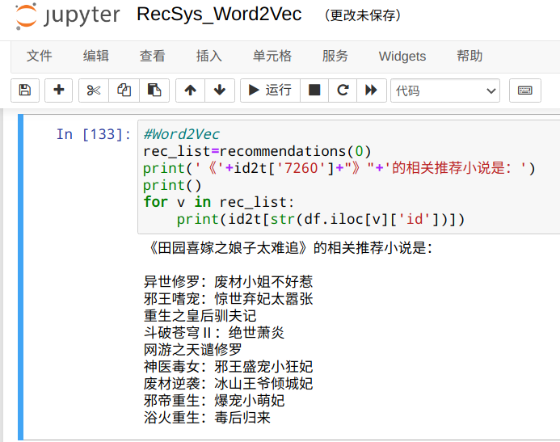

[TOC]

# 小说推荐系统

## 代码

RecSys_CountVectorizer.ipynb：词频统计后计算余弦相似度。

RecSys_Word2Vec.ipynb：PySpark Word2Vec再计算余弦相似度

## 数据

存储于data文件夹下。  

爬虫获取笔趣阁上的一万部小说信息，如标题、作者、字数、简介信息等。  

## 结果

存储于results文件夹下  

### CountVectorizer结果

### Word2Vec结果

